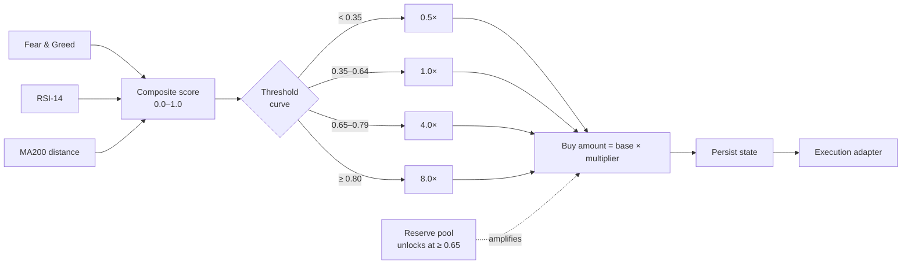

# Smart DCA — Logic Brief

**For:** Liquidbots dev team
**Purpose:** Reference spec for the decision logic behind a smart dollar-cost-averaging accumulator. This describes *what the bot decides and the options users control* — not how trades are executed. Treat the execution layer (exchange/protocol, settlement, custody) as a pluggable adapter that sits behind this logic.

---

## Core concept

The bot is a **decision engine**, not a trader. Each cycle it produces a single number — a **composite score** from `0.0` to `1.0` — and that score maps deterministically to a **buy multiplier**. The multiplier scales a configurable base amount, and the resulting buy instruction is handed to whatever execution adapter the platform provides.

```
indicators  →  composite score (0.0–1.0)  →  buy multiplier  →  buy amount  →  [execution adapter]
```

Keep these three concerns cleanly separated:

1. **Signal layer** — pluggable indicators in, one normalized score out.
2. **Decision layer** — score maps to a multiplier via a tunable curve.
3. **Execution layer** — out of scope for this brief.

---

## 1. Signal layer (inputs)

Three market indicators, each normalized and blended into one composite score.

| Input | What it measures |
|---|---|
| Fear & Greed Index | Overall market sentiment extreme |
| RSI-14 | Short-term momentum / oversold–overbought |
| MA200 distance | Price's % distance from the 200-day moving average |

**Design note for devs:** treat indicators as plug-ins. The contract is *indicators in → single composite score out*. Indicators should be swappable and individually weightable without touching the decision layer.

---

## 2. Decision layer (score → action)

The composite score maps to a buy multiplier through a tunable threshold curve. The multiplier scales the **base daily amount** (the "drip").

| Composite score | Buy multiplier | Intent |
|---|---|---|
| `< 0.35` | 0.5× | Trim — market looks hot / expensive |
| `0.35 – 0.64` | 1.0× | Baseline drip |
| `0.65 – 0.79` | 4.0× | High conviction |
| `≥ 0.80` | 8.0× | Maximum conviction |

> Example: a base drip of $20 at a 4.0× multiplier produces an $80 buy instruction for that cycle.

---

## 3. Reserve pool (the amplifier)

A **logical accounting pool** — pure state, not separate infrastructure. It lets the bot save "dry powder" on neutral days and deploy it on strong ones.

- Fills at **40% of each daily drip**, up to a configurable **cap**.
- **Unlocks at composite score ≥ 0.65** to amplify high-conviction buys.
- When unlocked, it supplements the base buy for that cycle.

**Design note:** this is just a counter in persisted state. No wallet, no infrastructure — the platform's existing balance/ledger model can hold it.

---

## 4. User-configurable options

The settings end users tune. This is likely the most relevant section for product/UX scoping.

| Option | Behavior |
|---|---|
| **Base drip amount** | Daily buy size at 1.0× |
| **Score thresholds + multipliers** | The full buy curve (the table in §2) is tunable |
| **Reserve fund rate** | % of each drip routed to the reserve (default 40%) |
| **Reserve cap** | Maximum reserve accumulation |
| **Reserve unlock threshold** | Score at which the reserve deploys (default 0.65) |
| **No-buy-zone toggle** | Off → buys every cycle. On → skips buying below a set score |
| **Schedule** | Run frequency and time of day |
| **Budget model** | Live balance check vs. fixed period cap |

---

## 5. Implementation note worth flagging

**State persists *before* execution.** The bot writes its updated state (drip accrual, reserve balance, schedule pointer) *before* the buy instruction goes out. If a cycle fails downstream, the accrued drip carries forward to the next cycle rather than being lost. Build the state write and the execution call as distinct, ordered steps — never assume the buy succeeded before persisting.

---

## Flow summary


